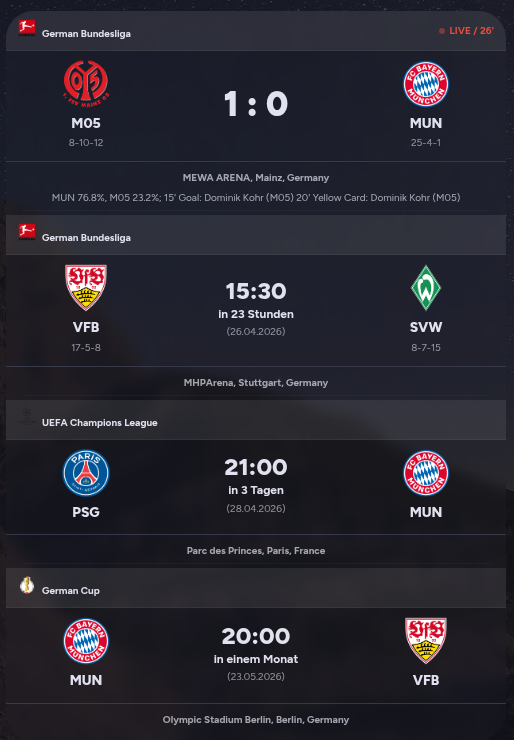
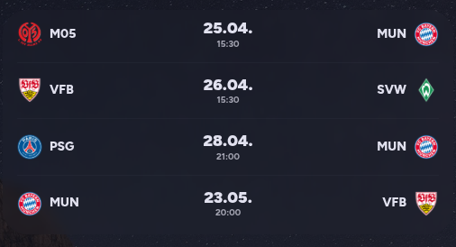

# Compact Team Tracker Card

A highly customizable and space-saving Lovelace card for the [Team Tracker Integration](https://github.com/vasqued2/ha-teamtracker). This card is optimized to display multiple sports events simultaneously without cluttering your Home Assistant dashboard.

---

## 📋 Requirements

This card is a frontend display and requires the [Team Tracker Integration](https://github.com/vasqued2/ha-teamtracker) to be installed via HACS first. 

---

## 📸 Screenshots

### Standard Card Layout with multiple Teams
The detailed view showing all match information, venue, and status.

### Ultra-Compact Layout
The space-saving table view, perfect for tracking many teams at once.

### Visual Editor
Multiple options for customization.

---

## ✨ Features

* **Two Layout Modes:** Toggle between the detailed **Standard Card View** and the minimalist **Ultra-Compact Layout** (table view).
* **Smart Filter:** Option to show only the next upcoming or currently live match.
* **Priority System:** Define a "Main Sensor" to ensure your favorite team is always prioritized if matches start at the same time.
* **Auto-Cleanup:** Automatically hide finished matches from previous days at midnight.
* **Scoring Plays:** Optional list of scorers for live and finished matches, including timestamps.
* **Multi-Language:** Built-in support for **English** and **German** (auto-detected from Home Assistant settings).

---

## 🚀 Installation

### Method 1: Manually add repository to HACS (recommended):

1. Open HACS section in Home Assistant.
2. Click on the 3 dots in the top right corner.
3. Select "Custom repositories".
4. Add the URL to the repository.
    * URL: `https://github.com/ChamesBont/compact-team-tracker-card/`
    * Type: `Dashboard`
5. Click the "ADD" button.

### Method 2: Manual Installation

1.  Download the `compact-team-tracker-card.js` file from this repository.
2.  Upload it to your Home Assistant `/config/www/` folder.
3.  Add the resource in Home Assistant:
    * **Settings** -> **Dashboards** -> **Three dots (top right)** -> **Resources** -> **Add Resource**.
    * URL: `/local/compact-team-tracker-card.js`
    * Type: `JavaScript Module`

---

## 🛠 Configuration Options

The card features a full **Graphic User Interface (GUI)** editor. No YAML coding required!

| Option | Description |
| :--- | :--- |
| **Manage Teams** | Add all Team Tracker sensors you want to follow. |
| **Priority** | Select your main team. It wins the "tie-break" if games start at the exact same time. |
| **Show Next Only** | Limits the display to the single most relevant current or upcoming match. |
| **Ultra-Compact Layout** | Switches to the space-saving table view. |
| **Show League Info** | Toggle the visibility of the league logo and name in the header. |
| **Hide Finished Matches** | Automatically hides matches from previous days to keep the dashboard clean. |
| **List Scorers** | Displays who scored and the time of the goal. |
| **Show Statistics (S-U-N)** | Displays the team's current season record (Wins-Draws-Losses). |

---

## 🤝 Acknowledgments

* This project was developed with the significant assistance of **Gemini**, Google's AI collaborator, which helped in coding, refining, and documenting this card.
* Special thanks to the Home Assistant community for the inspiration to create a more compact sport tracking solution.
