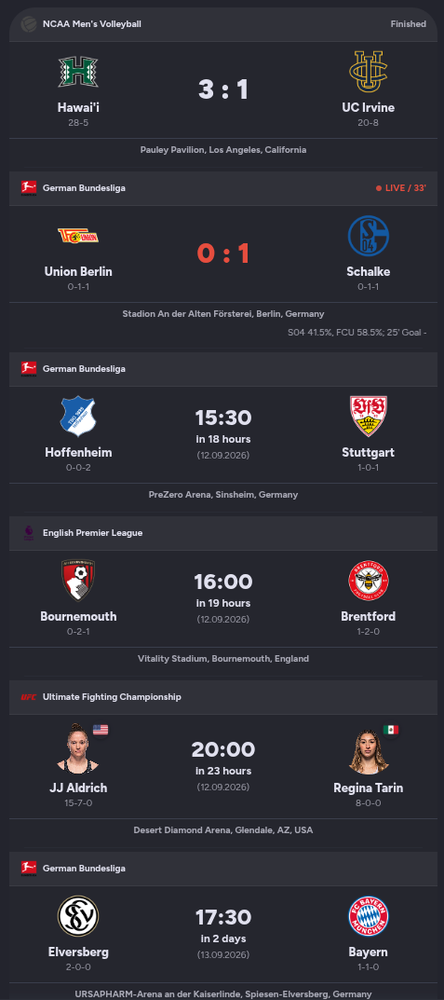
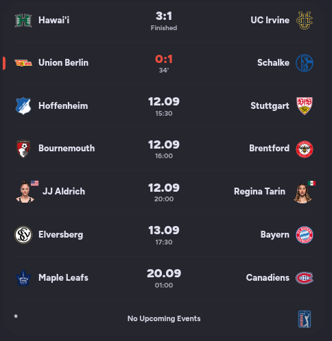
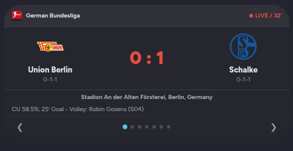
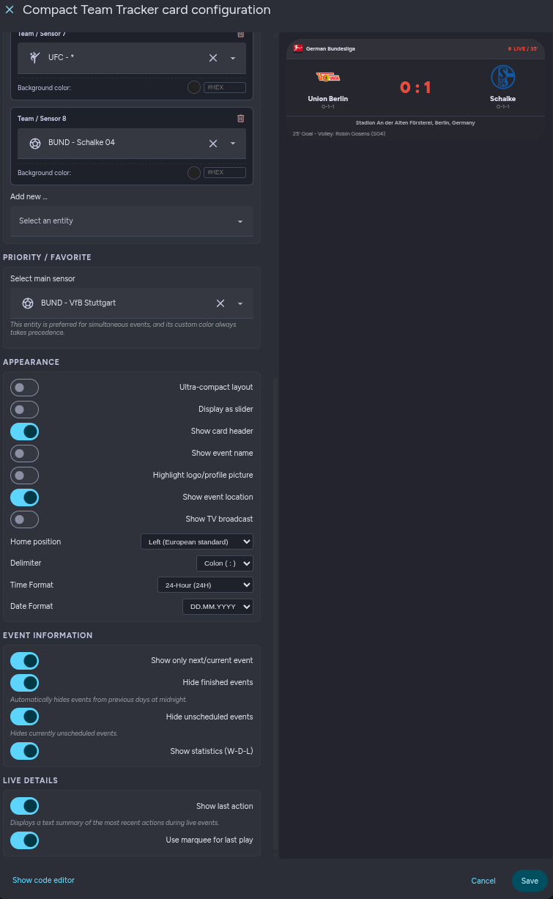
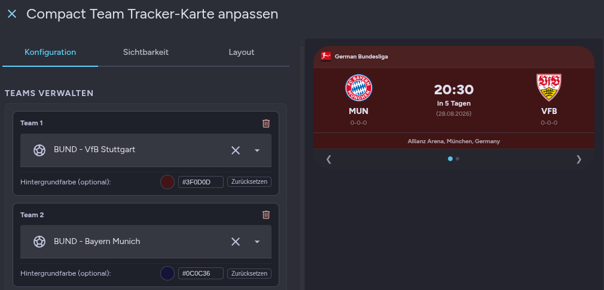

# Compact Team Tracker Card

A highly customizable and space-saving Lovelace card for the [Team Tracker Integration](https://github.com/vasqued2/ha-teamtracker). This card is optimized to display multiple sports events simultaneously without cluttering your Home Assistant dashboard.

---

## 📋 Requirements

This card is a frontend display and requires the [Team Tracker Integration](https://github.com/vasqued2/ha-teamtracker) to be installed via HACS first. 

---

## 📸 Screenshots

### Standard Card Layout with multiple Teams
The detailed view showing all match information, venue, and status.

### Ultra-Compact Layout
The space-saving table view, perfect for tracking many teams at once.

### Carousel Layout / Slider
Another space-saving view.

### Visual Editor
Multiple options for customization.

---

## ✨ Features

* **Three Layout Modes:** Toggle between the detailed **Standard Card View**, the minimalist **Ultra-Compact Layout** (table view) and the **Compact Carousel/Slider**.
* **Smart Filter:** Option to show only the next upcoming or currently live match.
* **Priority System:** Define a "Main Sensor" to ensure your favorite team is always prioritized if matches start at the same time.
* **Auto-Cleanup:** Automatically hide finished matches from previous days at midnight.
* **Scoring Plays:** Optional list of scorers for live and finished matches, including timestamps.
* **Custom background color:** Set your own background color for each Team.
* **Score Delimiter Option:** Choose between colon (:) and dash (-) as the score separator.
* **Home Team Position:** Display the home team on the Left (European standard) or Right (US style: Away @ Home).
* **Multi-Language:** Built-in support for **English** and **German** (auto-detected from Home Assistant settings).

---

## 🚀 Installation

### Method 1: via HACS (recommended):

### Method 2: Manually add repository to HACS:

1. Open HACS section in Home Assistant.
2. Click on the 3 dots in the top right corner.
3. Select "Custom repositories".
4. Add the URL to the repository.
    * URL: `https://github.com/ChamesBont/compact-team-tracker-card/`
    * Type: `Dashboard`
5. Click the "ADD" button.

### Method 3: Manual Installation

1.  Download the `compact-team-tracker-card.js` file from this repository.
2.  Upload it to your Home Assistant `/config/www/` folder.
3.  Add the resource in Home Assistant:
    * **Settings** -> **Dashboards** -> **Three dots (top right)** -> **Resources** -> **Add Resource**.
    * URL: `/local/compact-team-tracker-card.js`
    * Type: `JavaScript Module`

---

### ⚙️ Configuration Options

| Option | Type | Default | Description |
| :--- | :--- | :--- | :--- |
| `type` | string | **Required** | `custom:compact-team-tracker` |
| `entities` | list | **Required** | List of entity IDs from the `team-tracker` integration. |
| `layout` | string | `standard` | Card layout style. Options: `standard` or `ultra`. |
| `slider` | boolean | `false` | Enables carousel / slider view with swipe/navigation dots. |
| `show_league` | boolean | `true` | Displays the league name and logo in the card header (standard mode). |
| `logo_shadow` | boolean | `false` | Highlights team logos and athlete portraits with a subtle glow/drop-shadow. |
| `show_location` | boolean | `true` | Shows venue and match location in the card footer. |
| `show_tv_network` | boolean | `true` | Displays broadcasting TV network or streaming channel in the footer. |
| `home_team_position` | string | `left` | Alignment of the home team. Options: `left` (European standard) or `right` (US Away @ Home). |
| `score_delimiter` | string | `:` | Separator symbol between scores. Options: `:` or `-`. |
| `show_next_only` | boolean | `false` | Displays only the next chronologically upcoming match (ignored when `slider: true`). |
| `only_today` | boolean | `false` | Hides finished games (`POST`) from previous days at midnight. |
| `hide_offseason` | boolean | `false` | Hides teams currently in off-season, bye weeks, or without scheduled matches (`NOT_FOUND` / `BYE`). |
| `show_record` | boolean | `false` | Shows season statistics (e.g., Win-Draw-Loss record) below the team name. |
| `show_last_play` | boolean | `true` | Displays a summary text of the latest play during live games. |
| `last_play_marquee` | boolean | `false` | Enables smooth scrolling ticker animation for the last play text. |
| `priority_entity` | string | *optional* | Primary team sensor ID. Prioritized for simultaneous kickoffs and card background coloring. |
| `team_colors` | map | *optional* | Custom HEX background colors mapped per entity (e.g. `sensor.team_tracker: "#1c1c1e"`). |

---

## 🤝 Acknowledgments

* This project was developed with the significant assistance of **Gemini**, Google's AI collaborator, which helped in coding, refining, and documenting this card.
* Special thanks to the Home Assistant community for the inspiration to create a more compact sport tracking solution.
